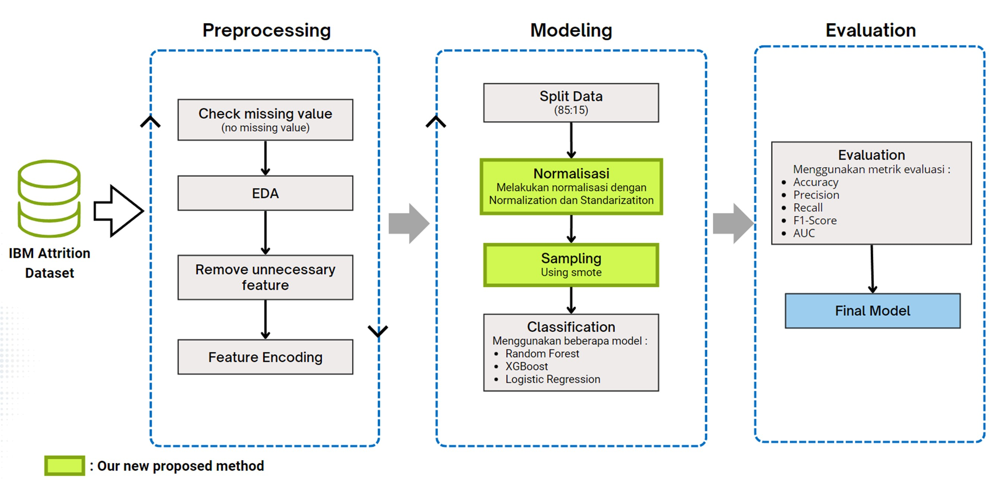
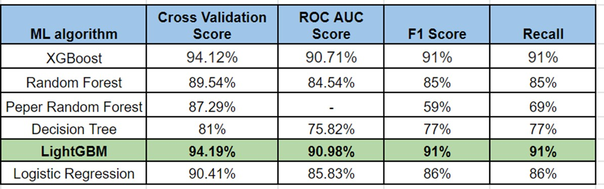
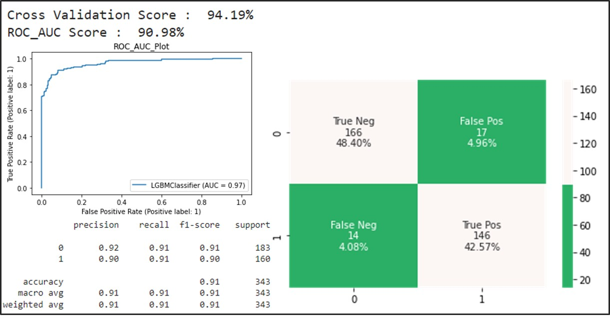
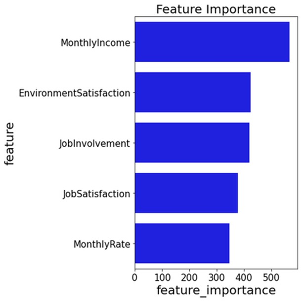
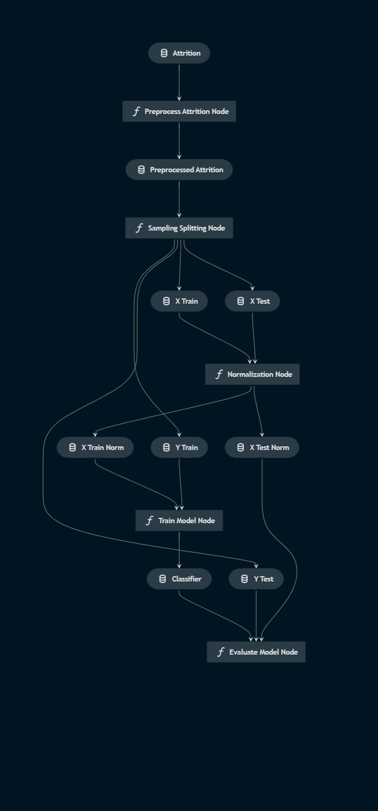
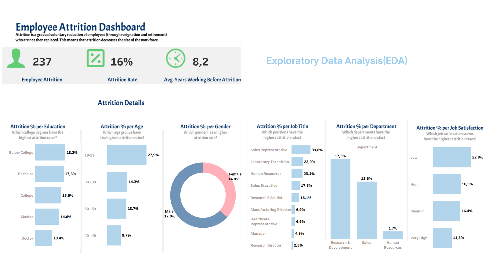

# Attrition Prediction

**In this project I conducted analysis and predictions related to turnover on employee data in a company**. Analysis is carried out to look for factors that cause turnover while predictions are used to predict which employees will make turnover. This project also carried out several techniques such as **normalization and sampling (due to imbalanced data)**. After modeling using several classification models, especially the tree algorithm, **it was found that LightGBM produced the best performance with F1-score = 91% and ROC-AUC Score = 91%.**

<br>

**This project uses kedro as a framework**

---
## Introduction

**Attrition/Turnover**  is reduction or loss of employees through different conditions.

Organizations usually invest more money and time in hiring staff and keeping them in the hope of adding value.
**However,** when an employee leaves the company, the company will experience a reduction in opportunity cost. The company will also experience a negative impact from this incident.

**Impact of Attrition**
* Cost of recruitment and hiring
* Time of transition
* Future product or service quality issues
* Cost of lost expertise 

---
##  Goals
* Finding the factors that cause attrition in an organization. **Then use these factors to formulate company policies related to attrition**
* Predicting whether an employee will engage in attrition. **This will help management act more quickly with their internal policies and strategies**
---

## Methodology



---
## Result
<br>

**Model Evaluation for all testing models**


**Best Model Performance Evaluation**


**Feature Importance**



---
## additional

**Kedro Pipeline Visualization**



<br>

**Dashboard**


---
## KEDRO
## Overview

This is your new Kedro project, which was generated using `Kedro 0.18.4`.

Take a look at the [Kedro documentation](https://kedro.readthedocs.io) to get started.

## Rules and guidelines

In order to get the best out of the template:

* Don't remove any lines from the `.gitignore` file we provide
* Make sure your results can be reproduced by following a [data engineering convention](https://kedro.readthedocs.io/en/stable/faq/faq.html#what-is-data-engineering-convention)
* Don't commit data to your repository
* Don't commit any credentials or your local configuration to your repository. Keep all your credentials and local configuration in `conf/local/`

## How to install dependencies

Declare any dependencies in `src/requirements.txt` for `pip` installation and `src/environment.yml` for `conda` installation.

To install them, run:

```
pip install -r src/requirements.txt
```

## How to run your Kedro pipeline

You can run your Kedro project with:

```
kedro run
```

## How to test your Kedro project

Have a look at the file `src/tests/test_run.py` for instructions on how to write your tests. You can run your tests as follows:

```
kedro test
```

To configure the coverage threshold, go to the `.coveragerc` file.

## Project dependencies

To generate or update the dependency requirements for your project:

```
kedro build-reqs
```

This will `pip-compile` the contents of `src/requirements.txt` into a new file `src/requirements.lock`. You can see the output of the resolution by opening `src/requirements.lock`.

After this, if you'd like to update your project requirements, please update `src/requirements.txt` and re-run `kedro build-reqs`.

[Further information about project dependencies](https://kedro.readthedocs.io/en/stable/kedro_project_setup/dependencies.html#project-specific-dependencies)

## How to work with Kedro and notebooks

> Note: Using `kedro jupyter` or `kedro ipython` to run your notebook provides these variables in scope: `context`, `catalog`, and `startup_error`.
>
> Jupyter, JupyterLab, and IPython are already included in the project requirements by default, so once you have run `pip install -r src/requirements.txt` you will not need to take any extra steps before you use them.

### Jupyter
To use Jupyter notebooks in your Kedro project, you need to install Jupyter:

```
pip install jupyter
```

After installing Jupyter, you can start a local notebook server:

```
kedro jupyter notebook
```

### JupyterLab
To use JupyterLab, you need to install it:

```
pip install jupyterlab
```

You can also start JupyterLab:

```
kedro jupyter lab
```

### IPython
And if you want to run an IPython session:

```
kedro ipython
```

### How to convert notebook cells to nodes in a Kedro project
You can move notebook code over into a Kedro project structure using a mixture of [cell tagging](https://jupyter-notebook.readthedocs.io/en/stable/changelog.html#release-5-0-0) and Kedro CLI commands.

By adding the `node` tag to a cell and running the command below, the cell's source code will be copied over to a Python file within `src/<package_name>/nodes/`:

```
kedro jupyter convert <filepath_to_my_notebook>
```
> *Note:* The name of the Python file matches the name of the original notebook.

Alternatively, you may want to transform all your notebooks in one go. Run the following command to convert all notebook files found in the project root directory and under any of its sub-folders:

```
kedro jupyter convert --all
```

### How to ignore notebook output cells in `git`
To automatically strip out all output cell contents before committing to `git`, you can run `kedro activate-nbstripout`. This will add a hook in `.git/config` which will run `nbstripout` before anything is committed to `git`.

> *Note:* Your output cells will be retained locally.

## Package your Kedro project

[Further information about building project documentation and packaging your project](https://kedro.readthedocs.io/en/stable/tutorial/package_a_project.html)
